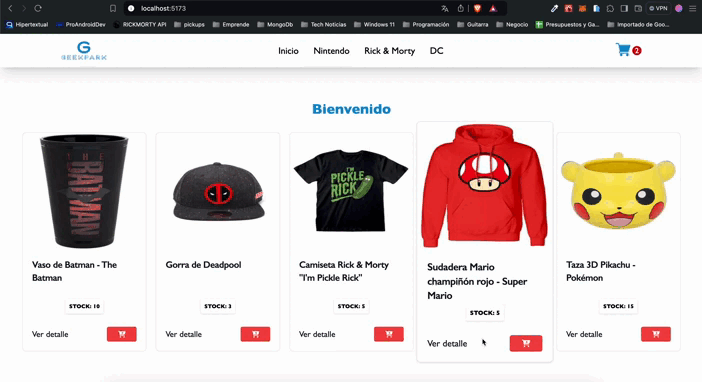

## Table of Contents
1. [Información General](#general-info)
2. [Tecnologias](#technologies)
3. [Instalación](#installation)
4. [Dependencias](#dependencies)

## Información General
Este proyecto es el inicio de un ecommerce creado con React-Vite, desde el curso de React


### Tecnologias
Teconologias usadas:


* [React](https://es.react.dev/): Versión 18.3.1
* [Vite](https://vitejs.dev/): Versión 5.3.1
* [Tailwind](https://tailwindcss.com/): Versión 3.4.4

## Instalación
Usar los siguientes comandos para instalación desde el directorio raiz del proyecto. 
```bash
$ npm install
$ npm run dev
```
    
## Dependencias
Librerias utilizadas: 
#### `firebase` `react-icons` `react-toastify` `react-loading-icons` `yup`

